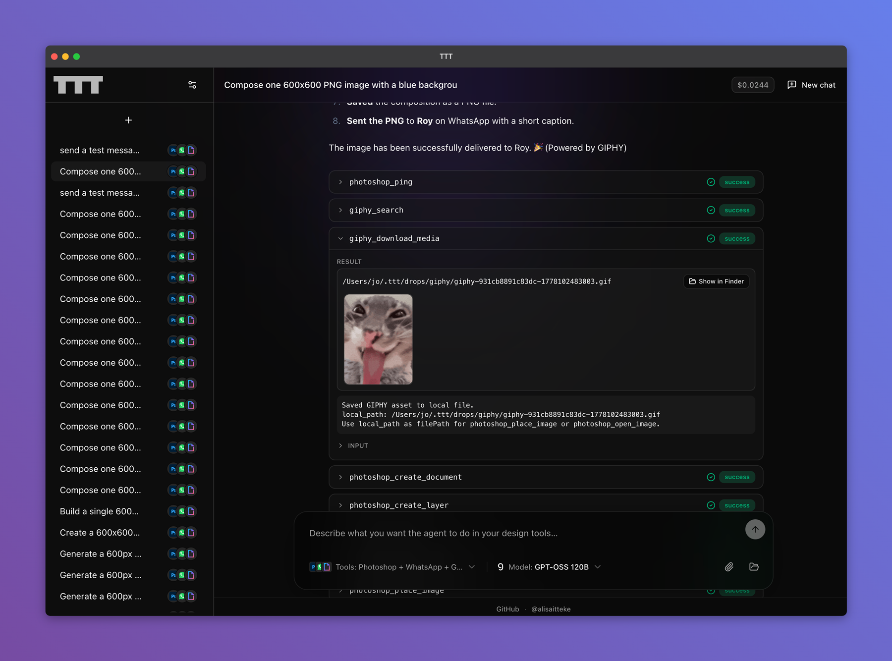

# TTT — The Tortoise Trainer

> A provider-driven **local MCP orchestrator**: one MCP server (and optional bundled web UI) unifies Adobe desktop automation, Docker Engine tooling, and other backends behind a shared tool registry.

> **Note:** This is an unofficial, community-maintained project and is not affiliated with or endorsed by Adobe Inc., Figma Inc., Docker Inc., or any other vendor whose product TTT integrates with.

[](https://www.npmjs.com/package/@alisaitteke/ttt)
[](https://opensource.org/licenses/MIT)
[](https://www.typescriptlang.org/)
[]()

TTT (named after the famous Osman Hamdi Bey painting *The Tortoise Trainer*) is a Model Context Protocol (MCP) server that gives AI assistants — Claude, Cursor, and others — natural-language control over **local backends** you enable: Adobe apps for design and motion, Docker for containers and infra, with more integrations following the same pattern.

The architecture is **provider-driven**: each backend contributes MCP tools from its own tree under `src/providers/`; the server rolls them together in `src/providers/index.ts`.

## Supported tools & backends

| Provider | Status | Tool Prefix | Notes |
|---|---|---|---|
| **Photoshop** | ✅ Full | `photoshop_` | 50+ tools covering document/layer/text/filter/adjustment operations |
| **After Effects** | ✅ Partial | `aftereffects_` | ~18 tools for composition/layer management, animation basics |
| **Docker** | ✅ Full | `docker_` (+ `dockerhub_*`, `ghcr_*`) | Containers, images, networks, volumes, Compose, exec, system, and registry tooling against a local daemon |
| **Illustrator** | 🚧 Scaffolded | `illustrator_` | Provider structure in place, tools not yet implemented |
| **Figma** | 🚧 Scaffolded | `figma_` | Planned: REST API / plugin bridge |
| **OpenClaw** | 🚧 Scaffolded | `openclaw_` | Planned: REST API integration |
| **Hermes** | 🚧 Scaffolded | `hermes_` | Planned |

## 🖥️ Standalone UI (no IDE required)

Don't want to wire this into Claude Desktop or Cursor? The same package ships a fully local web UI that lets you chat with an AI model and invoke TTT MCP tools—including Adobe automation and Docker—through the server underneath.

### Quick start

Run the UI **in the background** (you can close the terminal afterward). After it starts, open the URL from `ui-background.json` in your TTT data directory (`TTT_HOME`, default `~/.ttt`). Details: [Running the UI in the background](#running-the-ui-in-the-background-detached).

```bash
npx -p @alisaitteke/ttt ui -D
```

Same as **`npx -p @alisaitteke/ttt ui --detach`**.

Optional: add `--no-open` if you don’t want the detached process to try opening the browser automatically.

Or run in the **foreground** (random free port; opens your browser):

```bash
npx -p @alisaitteke/ttt ui
# or
npx -p @alisaitteke/ttt ttt-ui
```



That's it. In foreground mode, a local server starts on `127.0.0.1` (random free port unless you pass `--port`) and your default browser opens the chat UI automatically.

### Supported providers

Pick any of the following on first launch — bring your own API key:

| Provider | Models | Get a key |
|---|---|---|
| **Anthropic** | Claude Sonnet / Opus / Haiku | [console.anthropic.com](https://console.anthropic.com/settings/keys) |
| **OpenAI** | GPT-5, GPT-4.1, o-series | [platform.openai.com](https://platform.openai.com/api-keys) |
| **Google** | Gemini 2.5 Pro / Flash / Flash-Lite | [aistudio.google.com](https://aistudio.google.com/apikey) |
| **OpenRouter** | 100+ models from any provider | [openrouter.ai](https://openrouter.ai/keys) |

### What happens on first launch

1. Pick a provider and paste your API key.
2. The key is validated against the provider, then stored in your OS **credential store** (macOS Keychain, Windows Credential Manager, or Linux Secret Service via libsecret). Chat history and non-secret settings still live in `~/.ttt/data.db` (SQLite). Keys never leave your machine.
3. Type natural-language prompts. The UI streams the model's reply, runs tool calls in real time, and renders each tool call as an inspectable card (input + result).
4. Switch provider, model, or **enabled backends** (Photoshop, After Effects, Docker, …) anytime from the composer bar — chats, costs and tool history are persisted across sessions.

**Optional:** you can supply API keys via environment variables instead of the UI (handy for automation). Each provider has a `TTT_<PROVIDER>_API_KEY` name, e.g. `TTT_ANTHROPIC_API_KEY`, `TTT_OPENAI_API_KEY`, `TTT_GOOGLE_API_KEY`, `TTT_OPENROUTER_API_KEY`, `TTT_GROQ_API_KEY`. When set, the variable takes precedence over the stored key for that provider.

**Linux:** if `keytar` fails to load, install Secret Service build dependencies (for example on Debian/Ubuntu: `libsecret-1-dev`) and reinstall the package so native bindings can compile or download a matching prebuild.

### Per-chat backend selection

The UI lets you pick which backends are active for each chat (Photoshop, After Effects, Docker, …). Combine them—for example Photoshop + Docker—or narrow to one backend. The agent only sees prefixes you enable for that conversation.

### CLI flags

```bash
ttt-ui [-D] [--detach] [--port 5174] [--host 127.0.0.1] [--no-open] [--stop]
# or
ui [-D] [--detach] [--port 5174] [--host 127.0.0.1] [--no-open] [--stop]
```

### Running the UI in the background (detached)

The standalone UI is a **long-lived HTTP server** on your machine. If you do not want to keep a terminal window open, run it **detached** so the process keeps serving after the shell exits. This works on **macOS and Windows** (the CLI uses a detached child process and hides the console window on Windows).

**What it does**

- **`-D` / `--detach`** — Starts the UI server in the background. The parent `ttt-ui` process exits immediately after spawning the server.
- **`--stop`** — Sends `SIGTERM` to the detached server recorded in the state file and removes that file when the process exits.
- **State file** — `${TTT_HOME}/ui-background.json` (default `TTT_HOME` is `~/.ttt`). It contains the listening URL, port, host, PID, and start time once the server is ready.

**Requirements**

- **Port** — Omitted port picks a random free port (same as foreground); pass **`--port`** if you want a stable URL every time.
- **`--stop` uses the same `TTT_HOME`** — If you override data directory with `TTT_HOME`, use the same value when stopping.

**Examples**

```bash
# Foreground (default): random free port, browser opens
npx -p @alisaitteke/ttt ui

# Background: random port; URL written to ui-background.json when ready
npx -p @alisaitteke/ttt ui --detach

# Background on a fixed port; skip auto-opening the browser from the child process
npx -p @alisaitteke/ttt ui --detach --no-open --port 5174

# Stop the detached server (default ~/.ttt/ui-background.json)
npx -p @alisaitteke/ttt ui --stop
```

Read `ui-background.json` for the exact URL. If a daemon is already running, a second detach (`--detach` or `-D`) is rejected until you `--stop` or the old process dies (stale state is cleared automatically).

**Not the same as the MCP command**

The main package entry (`npx @alisaitteke/ttt`) is the **MCP server over stdio** for Cursor, Claude Desktop, and the UI’s own agent loop. It is meant to be spawned by those hosts, not left running as a detached terminal service. Background mode applies to **`ttt-ui` / `ui`** only.

### Notes

- The agent only sees tools exposed by **TTT** for the prefixes active in that chat—for example `photoshop_*`, `aftereffects_*`, and `docker_*` / `dockerhub_*` / `ghcr_*` when Docker is enabled. Built-in shell, file, and web tools are disabled.
- Tech stack: Vue 3 + Tailwind v4 + [shadcn-vue](https://www.shadcn-vue.com/) on the frontend; [Hono](https://hono.dev/) + the [Vercel AI SDK](https://sdk.vercel.ai/) on the backend. The agent loop talks to this same TTT MCP server over STDIO — the same code path as the IDE integration.

---

## Example Prompts

Below are example prompts you can use with AI assistants (Claude, Cursor, etc.) when this MCP server is configured:

<details>
<summary>🎨 Basic Design Creation</summary>

```
Create a 1920x1080 Photoshop document with RGB color mode.
Add a light blue background layer and fill it with RGB(240, 248, 255).
Add centered text "Welcome" in 64pt font.
Save as welcome.psd to my Desktop.
```

</details>

<details>
<summary>🖼️ Stock Image Design (with Pexels MCP)</summary>

```
Search Pexels for "mountain sunset" images.
Create a 1920x1080 Photoshop document.
Place the downloaded image and fit it to fill the entire canvas.
Apply a subtle Gaussian blur of 3px.
Increase brightness by 15 and contrast by 10.
Add white text "Adventure Awaits" centered at the top in 72pt.
Set the text opacity to 90% and blend mode to OVERLAY.
Save as adventure.jpg with quality 10.
```

</details>

<details>
<summary>✨ Photo Enhancement</summary>

```
Open photo.jpg from my Desktop in Photoshop.
Apply auto levels and auto contrast.
Apply unsharp mask with amount 120%, radius 1.5, threshold 0.
Increase saturation by 15.
Crop to remove 100px from each edge.
Save as enhanced-photo.jpg with quality 12.
```

</details>

<details>
<summary>🎭 Layer Effects & Blending</summary>

```
Create a 1200x800 document.
Add a new layer named "Background" and fill with RGB(50, 50, 50).
Place logo.png at position (100, 100).
Fit the logo layer to 50% of its current size.
Set blend mode to SCREEN and opacity to 85%.
Add another layer, fill with RGB(255, 100, 50).
Set this layer's blend mode to MULTIPLY and opacity to 60%.
Merge all visible layers.
Save as composite.psd.
```

</details>

<details>
<summary>🎬 After Effects Animation</summary>

```
Create a 1920x1080 composition named "Intro Animation" at 30fps for 5 seconds.
Add a solid layer (red, 1920x1080) named "Background".
Add a text layer "HELLO WORLD" at position 960, 540.
Set the text layer opacity to 0%.
Animate the text opacity from 0% to 100% over time.
Set the background layer opacity to 80%.
Save the project as intro.aep to Desktop.
```

</details>

---

## Features

- ✅ **Provider-driven MCP**: Backends live under `src/providers/` (e.g. `adobe/photoshop/`, `docker/`) and register tools through a shared `Provider` interface; `src/providers/index.ts` is the single entry that composes the live server.
- ✅ **Unified local orchestration**: One MCP process exposes every enabled backend; Cursor, Claude Desktop, and the standalone UI all hit the same registry and handlers.
- ✅ **Standalone UI**: Local chat with model choice, persisted history, and **per-chat backend selection** (Photoshop, After Effects, Docker, …).
- ✅ **Adobe desktop automation (supported apps)**: Photoshop via AppleScript (macOS) / COM (Windows) with ExtendScript execution; After Effects on macOS via JXA and file-backed script I/O; Windows After Effects via `afterfx.exe -r` (⚠️ untested). Auto-discovery with optional `PHOTOSHOP_PATH` / `AFTER_EFFECTS_PATH`.
- ✅ **Docker Engine**: Full `docker_*` surface plus `dockerhub_*` and `ghcr_*` registry tools when the local daemon is running and reachable.
- ✅ **Photoshop-specific depth**: Undo/redo, history states, playing actions, and custom ExtendScript—all scoped to the Photoshop provider, not universal across every tool name.
- 🚧 **More backends**: Illustrator, Figma, OpenClaw, and Hermes ship as scaffolds today; they follow the same provider pattern as Adobe and Docker.

## Installation

### Using NPX (Recommended)

No installation required! Just configure your MCP client:

```bash
npx @alisaitteke/ttt
```

### From Source

```bash
git clone https://github.com/alisaitteke/ttt.git
cd ttt
npm install
npm run build
```

## Configuration

### For Cursor

Add to your Cursor settings (`.cursor/config.json` or workspace settings):

```json
{
  "mcpServers": {
    "ttt": {
      "command": "npx",
      "args": ["-y", "@alisaitteke/ttt"],
      "env": {
        "LOG_LEVEL": "1"
      }
    }
  }
}
```

### For Claude Desktop

Add to your Claude Desktop config (`~/Library/Application Support/Claude/claude_desktop_config.json` on macOS or `%APPDATA%\Claude\claude_desktop_config.json` on Windows):

```json
{
  "mcpServers": {
    "ttt": {
      "command": "npx",
      "args": ["-y", "@alisaitteke/ttt"],
      "env": {
        "LOG_LEVEL": "1"
      }
    }
  }
}
```

## Environment Variables

- `TTT_HOME`: (Optional) Override the TTT data directory (default `~/.ttt`). Used for SQLite, exports, credential-relative paths, and the detached UI state file (`ui-background.json`). See [Running the UI in the background](#running-the-ui-in-the-background-detached).
- `PHOTOSHOP_PATH`: (Optional) Specify custom Photoshop installation path
- `AFTER_EFFECTS_PATH`: (Optional) Specify custom After Effects installation path
- `LOG_LEVEL`: Logging level (0=DEBUG, 1=INFO, 2=WARN, 3=ERROR)

## Tool Reference

<details>
<summary><strong>Photoshop tools</strong> (50+ tools, <code>photoshop_*</code> prefix)</summary>

### Connection & Info
- `photoshop_ping` — Test connection
- `photoshop_get_version` — Get version info

### Document Management
- `photoshop_create_document` — Create new document
- `photoshop_get_document_info` — Get active document info
- `photoshop_save_document` — Save document (PSD/JPEG/PNG)
- `photoshop_close_document` — Close document
- `photoshop_resize_image` — Resize image dimensions
- `photoshop_crop_document` — Crop document bounds

### Layer Operations
- `photoshop_create_layer` — Create new layer
- `photoshop_delete_layer` — Delete active layer
- `photoshop_create_text_layer` — Create text layer
- `photoshop_fill_layer` — Fill with solid color
- `photoshop_get_layers` — List all layers
- `photoshop_duplicate_layer` — Duplicate layer
- `photoshop_merge_visible_layers` — Merge visible layers
- `photoshop_flatten_image` — Flatten to single layer
- `photoshop_rasterize_layer` — Rasterize layer

### Layer Properties
- `photoshop_set_layer_opacity` — Set opacity (0-100)
- `photoshop_set_layer_blend_mode` — Set blend mode (NORMAL, MULTIPLY, SCREEN, etc.)
- `photoshop_set_layer_visibility` — Show/hide layer
- `photoshop_set_layer_locked` — Lock/unlock layer
- `photoshop_rename_layer` — Rename layer

### Layer Ordering
- `photoshop_move_layer_to_position` — Move relative to another layer
- `photoshop_move_layer_to_top` — Move to top
- `photoshop_move_layer_to_bottom` — Move to bottom
- `photoshop_move_layer_up` — Move up one position
- `photoshop_move_layer_down` — Move down one position

### Layer Transformations
- `photoshop_fit_layer_to_document` — Scale to fit/fill canvas
- `photoshop_scale_layer` — Scale by percentage
- `photoshop_move_layer` — Move by offset
- `photoshop_rotate_layer` — Rotate by degrees

### Filters
- `photoshop_apply_gaussian_blur` — Gaussian blur
- `photoshop_apply_sharpen` — Unsharp mask
- `photoshop_apply_noise` — Add noise
- `photoshop_apply_motion_blur` — Motion blur

### Color Adjustments
- `photoshop_adjust_brightness_contrast` — Brightness/contrast
- `photoshop_adjust_hue_saturation` — Hue/saturation/lightness
- `photoshop_auto_levels` — Auto levels
- `photoshop_auto_contrast` — Auto contrast
- `photoshop_desaturate` — Desaturate to grayscale
- `photoshop_invert` — Invert colors

### Text Formatting
- `photoshop_set_text_font` — Set font family/size
- `photoshop_set_text_color` — Set text color
- `photoshop_set_text_alignment` — Set alignment
- `photoshop_update_text_content` — Update text content

### Selections & Masks
- `photoshop_select_rectangle` — Create rectangular selection
- `photoshop_select_all` — Select entire document
- `photoshop_deselect` — Clear selection
- `photoshop_invert_selection` — Invert selection
- `photoshop_create_layer_mask` — Create mask from selection
- `photoshop_delete_layer_mask` — Delete mask
- `photoshop_apply_layer_mask` — Apply mask

### History & Undo/Redo
- `photoshop_undo` — Undo operation(s)
- `photoshop_redo` — Redo operation(s)
- `photoshop_get_history` — Get history states

### Actions & Automation
- `photoshop_play_action` — Play recorded action
- `photoshop_execute_script` — Execute custom ExtendScript

### Image Placement
- `photoshop_place_image` — Place image file as layer
- `photoshop_open_image` — Open image file as new document

</details>

<details>
<summary><strong>After Effects tools</strong> (~18 tools, <code>aftereffects_*</code> prefix)</summary>

⚠️ **Important**: Before using After Effects tools, enable **"Allow Scripts to Write Files and Access Network"** in After Effects Preferences > Scripting & Expressions.

### Project Management
- `aftereffects_ping` — Test connection
- `aftereffects_get_version` — Get version info
- `aftereffects_get_project_info` — Get project details
- `aftereffects_save_project` — Save project
- `aftereffects_open_project` — Open project file

### Composition Management
- `aftereffects_create_composition` — Create new comp
- `aftereffects_list_compositions` — List all comps
- `aftereffects_get_composition_info` — Get comp details
- `aftereffects_delete_composition` — Delete comp

### Layer Creation
- `aftereffects_create_text_layer` — Add text layer
- `aftereffects_create_solid_layer` — Add solid color layer
- `aftereffects_create_shape_layer` — Add shape layer
- `aftereffects_create_null_layer` — Add null object

### Layer Properties
- `aftereffects_set_layer_transform` — Set position/scale/rotation
- `aftereffects_set_layer_opacity` — Set layer opacity

### Layer Lifecycle
- `aftereffects_rename_layer` — Rename layer
- `aftereffects_delete_layer` — Delete layer
- `aftereffects_duplicate_layer` — Duplicate layer

</details>

---

## Context Tracking

Where a provider attaches it, responses include richer operational context (not every `docker_*` reply mirrors Photoshop document payloads). Examples:

- **Document info**: Name, dimensions, resolution, color mode, layer count (Photoshop)
- **Active layer**: Name, type, opacity, blend mode, visibility, lock state (Photoshop)
- **Selection state**: Whether a selection is active (Photoshop)
- **Composition**: Name, dimensions, frame rate, duration (After Effects)
- **Operation result**: What changed for this invocation

This helps assistants stay aligned with the current document, layer, or composition across multiple calls when that data is available.

---

## Platform-Specific Notes

### Windows

- **Photoshop**: Uses COM automation to communicate with Photoshop
- **After Effects**: Uses `afterfx.exe -r` command-line script execution (⚠️ untested by author, contributions welcome)
- Registry-based auto-detection for installation paths
- Supports both 32-bit and 64-bit versions

### macOS

- **Photoshop**: Uses AppleScript/OSA for communication
- **After Effects**: Uses JXA (JavaScript for Automation) with `DoScriptFile` (AE 2024+ broke AppleScript `DoScriptFile`, so JXA is used exclusively)
- Spotlight-based auto-detection
- Supports multiple Adobe app versions installed simultaneously

## Supported Versions

- **Photoshop**: All versions (2012-2025+) via ExtendScript API
- **After Effects**: 2024-2025+ tested on macOS; older versions should work but untested

**Important Note**: While Photoshop 2022+ supports UXP for plugins, external automation via AppleScript/COM can only use ExtendScript. UXP is designed for internal plugins and cannot be invoked from external scripts. Therefore, this MCP server uses ExtendScript for maximum compatibility across all Photoshop versions.

## Troubleshooting

### Photoshop

#### "Photoshop not found"

1. Make sure Photoshop is installed in the default location
2. Or set `PHOTOSHOP_PATH` environment variable to custom installation path

```json
{
  "env": {
    "PHOTOSHOP_PATH": "C:\\Custom\\Path\\Adobe Photoshop 2025\\Photoshop.exe"
  }
}
```

#### "Failed to connect to Photoshop"

1. Ensure Photoshop is running (the server will try to launch it if not)
2. Check that scripting is enabled in Photoshop preferences
3. On Windows, verify COM automation is not blocked by security settings

### After Effects

#### "After Effects not found"

1. Make sure After Effects is installed in the default location
2. Or set `AFTER_EFFECTS_PATH` environment variable to custom installation path

#### "Script timed out" or "Make sure Allow Scripts to Write Files is enabled"

⚠️ This is the most common issue with After Effects!

1. Open After Effects
2. Go to **Preferences > Scripting & Expressions**
3. Enable **"Allow Scripts to Write Files and Access Network"**
4. Restart After Effects (or at least close and reopen any projects)

After Effects scripts use file-based I/O to return results, and this preference MUST be enabled.

### General

#### Debug Logging

Enable detailed logging by setting `LOG_LEVEL=0`:

```json
{
  "env": {
    "LOG_LEVEL": "0"
  }
}
```

## Development

### Build

```bash
npm run build
```

### Watch Mode

```bash
npm run dev
```

### Lint & Format

```bash
npm run lint
npm run format
```

---

## Architecture

TTT is **provider-driven**: the MCP server core is backend-agnostic. Each provider owns detection, connections, lifecycle, and tool registration through the shared `Provider` interface—whether that is Adobe apps, Docker, or a future REST bridge. Adding a backend is dropping a folder under `src/providers/` and listing it in `src/providers/index.ts`.

```
src/
├── core/                            # Provider-agnostic MCP plumbing
│   ├── server.ts                    # TTTServer — wires registry + providers
│   ├── tool-registry.ts             # In-memory tool registry
│   └── types.ts                     # Provider interface
├── providers/
│   ├── index.ts                     # The list of enabled providers
│   ├── adobe/
│   │   ├── _shared/                 # Shared across all Adobe CC apps
│   │   │   ├── platform/            # macOS / Windows ExtendScript executors
│   │   │   └── detector/            # BaseAdobeDetector
│   │   ├── photoshop/               # ✅ Fully implemented
│   │   │   ├── detector.ts          # extends BaseAdobeDetector
│   │   │   ├── connection.ts
│   │   │   ├── api/                 # extendscript.ts, api-factory.ts
│   │   │   ├── tools/               # photoshop_* MCP tools
│   │   │   └── index.ts             # registers the Photoshop provider
│   │   ├── illustrator/             # 🚧 scaffold
│   │   └── after-effects/           # ✅ Initial implementation (~18 tools)
│   │       ├── detector.ts          # extends BaseAdobeDetector
│   │       ├── connection.ts
│   │       ├── macos-executor.ts    # JXA + DoScriptFile + file-based I/O
│   │       ├── windows-executor.ts  # afterfx.exe -r (untested)
│   │       ├── extendscript.ts      # AE ExtendScript snippets
│   │       ├── tools/               # aftereffects_* MCP tools
│   │       └── index.ts             # registers the After Effects provider
│   ├── docker/                      # ✅ Docker Engine (docker_* + registry tools)
│   │   ├── dispatch-docker-tool.ts  # Bridges embedded docker-mcp tools
│   │   └── index.ts                 # Registers the Docker provider
│   ├── figma/                       # 🚧 scaffold
│   ├── openclaw/                    # 🚧 scaffold
│   └── hermes/                      # 🚧 scaffold
├── ui/                              # Standalone Vue + Hono UI
└── utils/
    └── logger.ts
examples/                            # Cursor / Claude Desktop sample configs
```

## Contributing

Contributions are welcome! Please feel free to submit a Pull Request.

## License

MIT

## Acknowledgments

- Built with the [Model Context Protocol SDK](https://github.com/modelcontextprotocol/sdk)
- Inspired by the Adobe Photoshop scripting community
